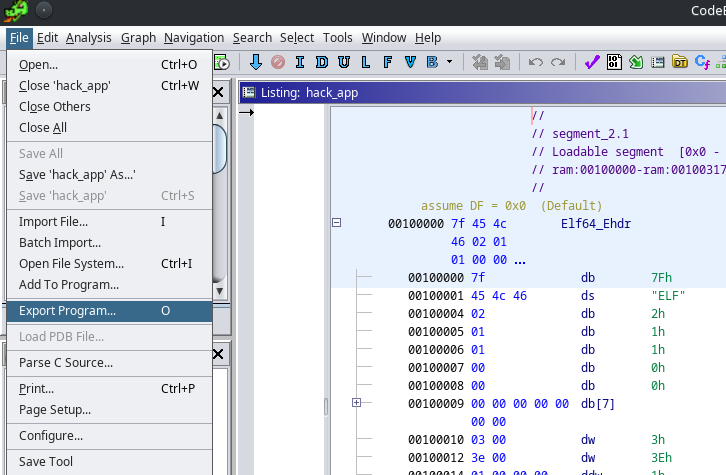
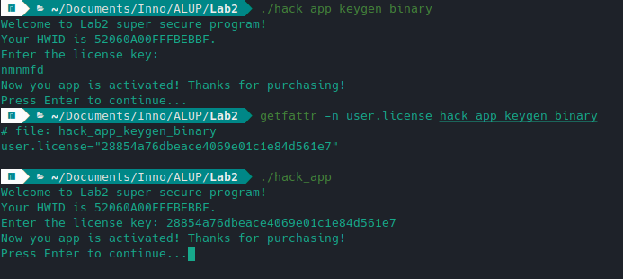

# Lab 2 GDB
Author: Anastasiia Stepanova
Sourse ASSEMBLY patch and keygen code:
[Available on Github](https://github.com/AsiiaPine/hack_app_hacking)

1. Create keygen for hack_app.
2. Create binary patch to disable licensing completely.

## Solution:
- ### Ghidra 
    While analyzing the C code generated by the program, I found that the entire security logic is based on if statements (in the main function), which are easy to hack inside the binary.\
    \
    
    
    Example:
    1. To change result of the code ```if (iVar1==0)``` (the variable is used to check 1- is the license already provided AND is the license key right) represented in assembler as ```75 07``` Where ```75``` is code of ***JNZ*** command, all is needed is to change JNZ to JZ by changing 75 to 74. \
    \
    \
    \
    The result will be the following: ```74 07``` or in C code ```if (iVar != 0) ```.
    Operations description from [StackOverflow](https://stackoverflow.com/questions/14267081/difference-between-je-jne-and-jz-jnz)
        ```{
            Op Code    | mnemonic  | Description
            -----------|-----------|----------------------------------------------- 
            74 cb      | JE rel8   | Jump short if equal (ZF=1). 
            74 cb      | JZ rel8   | Jump short if zero (ZF ← 1).

            0F 84 cw   | JE rel16  | Jump near if equal (ZF=1). Not supported in 64-bit mode.
            0F 84 cw   | JZ rel16  | Jump near if 0 (ZF=1). Not supported in 64-bit mode.

            0F 84 cd   | JE rel32  | Jump near if equal (ZF=1).
            0F 84 cd   | JZ rel32  | Jump near if 0 (ZF=1).

            75 cb      | JNE rel8  | Jump short if not equal (ZF=0).
            75 cb      | JNZ rel8  | Jump short if not zero (ZF=0).

            0F 85 cd   | JNE rel32 | Jump near if not equal (ZF=0).
            0F 85 cd   | JNZ rel32 | Jump near if not zero (ZF=0).}
            
    2. The second approach is to change the value in CMP function, when a variable is comparing with constant. I did that for ```local_24==0```.\
    \
    
    I changed the binary line ```83 7d e4 00``` by ```83 7d e4 01```. The result code looks like ```if (local_24 ==1)```
- ### Bless
    I didn't figure out how to modify the binary inside Ghidra and just wanted to keep the original C-described program, so I used Bless to modify the binary.
      So, I used both of the hacks above to generate the key in the same way as I did to create the patch.\
      \
    


## Keygen

After looking at the binary for several hours, I realized that I did not want to go so deep into the assembly and logic of the functions of external libraries called to create the md5decode variable. 

Therefore, the easiest way for me was to make the program think that I passed the correct key as in the example 1. After that I simply intercept the license of the patched program via ```getfattr -n user.license```. The license is then placed in the original hack_app.

Result:
1 - we get the key
2 - the key is working\
\
 \
\
All the commands has been added to small bash **keygen** script.


## Patch

I used the logic described in the second example to go directly to the line "your application is licensed for this PC!". \
\

    
